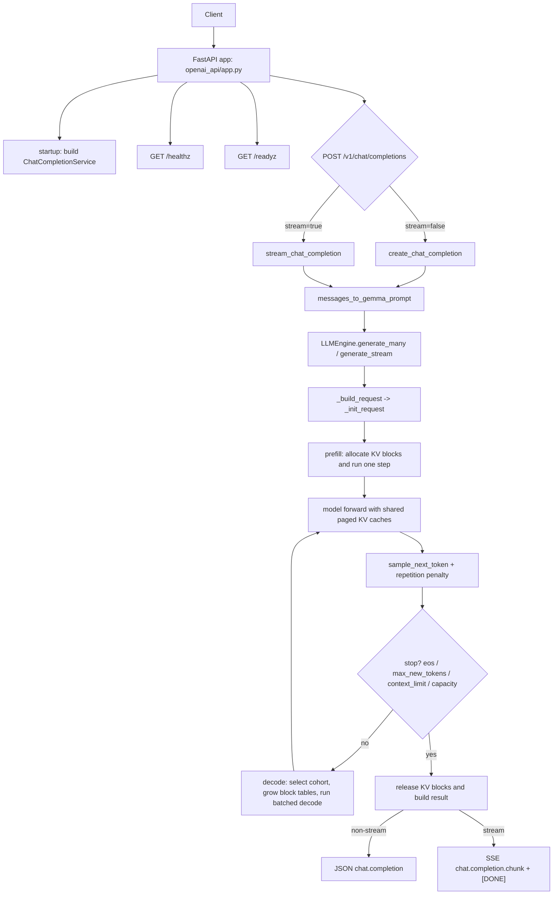

# Gemma 3 270M: Readable Minimal Implementation

This repository is a clean, minimal PyTorch implementation of Gemma-3-style inference, built to be easy to read and extend.

## Purpose

Provide a small, understandable codebase for:
- decoder-only model inference with block-based paged KV cache
- continuous multi-request scheduling with prefill/decode batching
- an OpenAI-compatible local chat API with readiness-aware startup

## Technical Scope

- Model: `gemma-3-270m` and `gemma-3-270m-it` checkpoints
- Current runtime target: `choose_model="270m"`
- Architecture: 18-layer decoder with mixed `sliding_attention` + `full_attention`
- Attention stack: GQA, RoPE (local/global bases), causal + optional sliding-window mask
- Normalization/MLP: Gemma-style RMSNorm and gated feedforward (`down(gelu(gate(x)) * up(x))`)
- Engine: single-device prefill/decode scheduler with round-robin decode, decode-step batching, and block-based paged KV allocation
- API: FastAPI app compatible with `POST /v1/chat/completions` plus `GET /healthz` and `GET /readyz`

## Install

```bash
python -m pip install torch tokenizers safetensors huggingface_hub fastapi uvicorn pydantic starlette
```

Or install the local package metadata:

```bash
python -m pip install -e ".[dev,benchmark]"
```

Model access note:
- You need approved access to Gemma checkpoints (for example `google/gemma-3-270m` / `google/gemma-3-270m-it`) before first download.
- If local model files already exist in `gemma-3-270m/` or `gemma-3-270m-it/`, they are reused.

Optional benchmark dependency:

```bash
python -m pip install pandas
```

## Run

Direct generation:

```bash
python main.py
```

OpenAI-like API server:

```bash
python -m openai_api.run
```

The API binds to `127.0.0.1:8000` by default. Use CLI flags or `GEMMA_API_*` environment variables to tune it:

```bash
python -m openai_api.run --host 0.0.0.0 --port 8080 --device cpu --default-max-tokens 64
GEMMA_API_MAX_KV_CACHE_TOKENS=65536 python -m openai_api.run
```

Query the API:

```bash
python query_fastapi.py --stream --prompt "Give me one short line about LLM inference."
```

## Project Structure

- `gemma3/`: model components, paged KV storage, RoPE, feedforward, tokenizer template, and weights mapping
- `inference/`: deep inference core: engine contract, generation types, scheduler, KV allocation, sampling, and batching policy
- `runtime/`: model/tokenizer loading, device resolution, runtime provider, and warmup boundary
- `app/`: serving/application layer: request validation, readiness, metrics, logging, and chat completion orchestration
- `adapters/openai/`: FastAPI/OpenAI compatibility adapter: schemas, routes, mapping, SSE, and HTTP errors
- `adapters/prometheus/`: metrics formatting adapter
- `config/`: typed runtime/server settings and environment/CLI parsing
- `engine/` and `openai_api/`: compatibility facades for older imports
- `main.py`: direct local generation flow
- `tests/`: scheduler and API response-shape tests

## Architecture Boundaries

The core design rule is: the inference core is deep, external interfaces are thin.

- `gemma3/` contains tensor/model code only and does not import serving, runtime, FastAPI, or OpenAI API modules.
- `inference/` owns generation lifecycle, scheduling, KV cache management, sampling, stop reasons, and engine contracts. It does not import FastAPI, OpenAI schemas, app services, or runtime loaders.
- `runtime/` builds ready model/tokenizer/backend objects from local files or Hugging Face artifacts. It does not import HTTP or app code.
- `app/` coordinates service behavior around the engine without depending on FastAPI or OpenAI schemas.
- `adapters/openai/` is the replaceable HTTP compatibility layer and must not import `torch` or construct models directly.

Architecture regression tests in `tests/architecture/` enforce these dependency rules.

## Engine Configuration

The scheduler now allocates KV memory in blocks as requests grow, rather than reserving an entire request budget up front.

- `max_kv_cache_tokens`: total KV token budget available to the engine
- `kv_block_size`: size of each KV allocation block
- `num_kv_blocks`: optional explicit number of blocks; if omitted, it is derived from `max_kv_cache_tokens // kv_block_size`

This keeps the engine readable while matching the basic vLLM-style idea: admit requests cheaply, grow cache usage incrementally, and free blocks immediately when a request finishes.

## API Operations

- `GET /healthz`: lightweight liveness probe
- `GET /readyz`: readiness probe; returns `200` only after `ChatCompletionService` has loaded successfully
- `GET /v1/models`: OpenAI-style local model listing
- `GET /stats`: JSON request/token/latency counters
- `GET /metrics`: dependency-free Prometheus-style text metrics
- `POST /v1/chat/completions`: returns `503` if service startup failed or is not yet complete

The API initializes `ChatCompletionService` during app startup, serializes access to the shared engine per process, enforces request/message size limits, and returns generic client-facing errors while logging details server-side.

Supported chat request controls include `max_tokens`, `temperature`, `top_p`, `top_k`, `repetition_penalty`, `seed`, `stop`, `stream`, and `stream_options.include_usage`.

## Request Flow



## Validation

```bash
python -m unittest discover -s tests -q
```

Scheduler tests cover round-robin decode ordering, paged KV isolation between requests, and block-capacity reuse / deferral.

Real `LLMEngine` regression tests (uses actual model/runtime, opt-in):

```bash
RUN_REAL_ENGINE_TESTS=1 python -m unittest -q tests/test_llmengine_regression_real.py
```

Real `LLMEngine` load tests (opt-in and heavier):

```bash
RUN_REAL_ENGINE_TESTS=1 RUN_REAL_ENGINE_LOAD_TESTS=1 python -m unittest -q tests/test_llmengine_load_real.py
```

Load threshold overrides (optional):
- `LOAD_MAX_ERROR_RATE`
- `LOAD_MAX_P95_TOTAL_S`
- `LOAD_MIN_THROUGHPUT_TPS`
