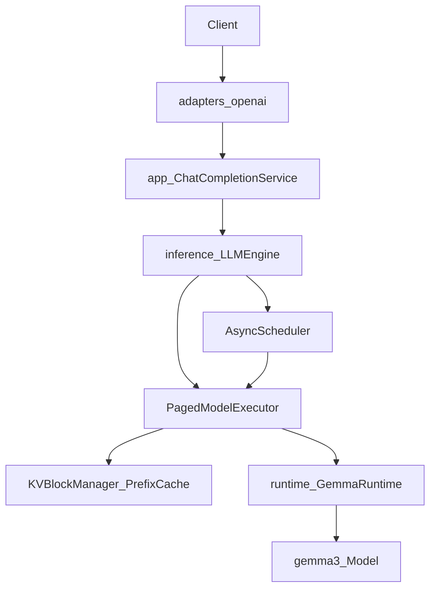
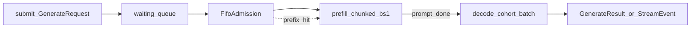

# Architecture

This document describes the **canonical serving stack** on `main` after the rock-solid architecture consolidation.

## Layering

| Layer | Package | Responsibility | Must not |
|-------|---------|----------------|----------|
| HTTP | `adapters/openai` | FastAPI, OpenAI schemas, SSE, HTTP errors | Import `torch` or load models |
| App | `app` | Prompting, validation, metrics, map to engine API | Depend on FastAPI / OpenAI schemas |
| Inference | `inference` | Scheduling, execution, KV, sampling, contracts | Import FastAPI, app, or runtime loaders |
| Runtime | `runtime` | Device/dtype, download weights, tokenizer | Import HTTP / app |
| Model | `gemma3` | Tensors, attention, paged KV storage, RoPE, MLP | Import serving / runtime |

Import boundaries are enforced by `tests/architecture/test_import_boundaries.py`.

## Inference core

### Components

- **`LLMEngine`** ([`inference/engine.py`](../inference/engine.py)) — thin façade: `generate` / `stream` / `abort` / `stats` / `shutdown`
- **`AsyncScheduler`** ([`inference/scheduler/scheduler.py`](../inference/scheduler/scheduler.py)) — queues, admission, timeouts, cancel, stream events; prefers prefill over decode each step
- **`FifoAdmissionPolicy`** ([`inference/scheduler/admission.py`](../inference/scheduler/admission.py)) — cap `max_concurrent_requests`
- **`DecodeBatchSelector`** ([`inference/scheduler/batch.py`](../inference/scheduler/batch.py)) — cohort by `(seq_len, sampling)` within a selection window
- **`PagedModelExecutor`** ([`inference/executor.py`](../inference/executor.py)) — tokenize, grow blocks, forward, sample (sync; no asyncio)
- **`KVBlockManager` + `PrefixCache`** ([`inference/kv/`](../inference/kv/)) — free-list blocks, refcounts, optional LRU prefix reuse

Model steps are **serialized** on the ASGI event loop (one executor owner).

### Prefill vs decode

| Phase | Batching | Notes |
|-------|----------|-------|
| Prefill | Always **batch size 1** | Optional `prefill_chunk_size`; non-final chunks skip LM head |
| Decode | Up to `decode_batch_size` | Same absolute sequence length + sampling hyperparameters |

### Logits

`Gemma3Model.forward(..., compute_logits=, logits_last_only=)`:

- Default: `out_head` on **last position only** → `[B, 1, V]`
- Intermediate chunked prefill: `compute_logits=False` (KV still updated)

### Attention / KV

- Paged append via `scatter_` into shared `PagedKVCache` per layer
- Batched SDPA with additive mask (causal / sliding + padding)
- Sliding-window mask uses `masked_fill_` (not `bool * -inf`, which produces NaNs)

## Runtime policy

[`runtime/provider.py`](../runtime/provider.py):

| Device | Dtype | `torch.compile` |
|--------|-------|-----------------|
| CUDA | `bfloat16` | Yes (`reduce-overhead`), unless `GEMMA_DISABLE_COMPILE=1` |
| CPU (default non-CUDA) | `float32` | No |
| MPS (opt-in `--device mps`) | `float32` | No |

Auto device order: **CUDA → CPU**. MPS is not auto-selected (paged gather/scatter is slower there for this model today).

Optional: `GEMMA_NUM_THREADS` → `torch.set_num_threads`.

## App + adapter

- **`ChatCompletionService`** builds `GemmaRuntime` + `LLMEngine`, formats chat turns (`use_instruct_model=False` on the engine so prompts are not double-templated)
- **`adapters/openai/routes.py`**: `/healthz`, `/readyz`, `/v1/models`, `/stats`, `/metrics`, `/v1/chat/completions`
- Entry: `python -m adapters.openai.run` / console script `gemma3-serve`

CLI entry: `main.py` / `gemma3-generate` (sets `use_instruct_model=True` and applies the chat template in the executor).

## Feature maturity

| Feature | Status |
|---------|--------|
| Paged KV | Canonical path |
| Continuous batching | Decode-centric; prefill not batched |
| Chunked prefill | Supported via `prefill_chunk_size` |
| Prefix cache | Opt-in; `scope` hard-coded `"default"` |
| OpenAI chat API | Streaming + non-streaming |
| Multi-GPU / speculative decode / Flash paged attn | Not implemented |

## Removed packages (do not resurrect)

| Removed | Replaced by |
|---------|-------------|
| `engine/` | `inference/` |
| `openai_api/` | `adapters/openai/` + `app/` + `config/` |
| `adapters/prometheus/` | Inline Prometheus text in app/service metrics |
| `gemma3/attention_vllm.py` | Unified `gemma3/attention.py` |

## Tests that guard the architecture

- `tests/architecture/` — import boundaries + canonical imports
- `tests/contract/` — `InferenceEngine` protocol
- `tests/test_continuous_batching.py`, `tests/test_round_robin.py` — scheduler behavior
- `tests/test_prefix_cache.py`, `tests/test_prefix_caching.py` — prefix cache
- `tests/test_openai_chat_api.py` — HTTP shapes

## Related scripts

- `scripts/benchmark_decode_throughput.py` — single-request tok/s
- `scripts/benchmark_concurrent_10.py` — concurrent short gens
- `scripts/demo_chunked_prefill.py` / `benchmark_chunked_prefill_long_prompts.py` — chunked prefill
